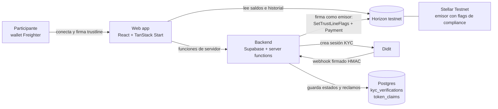
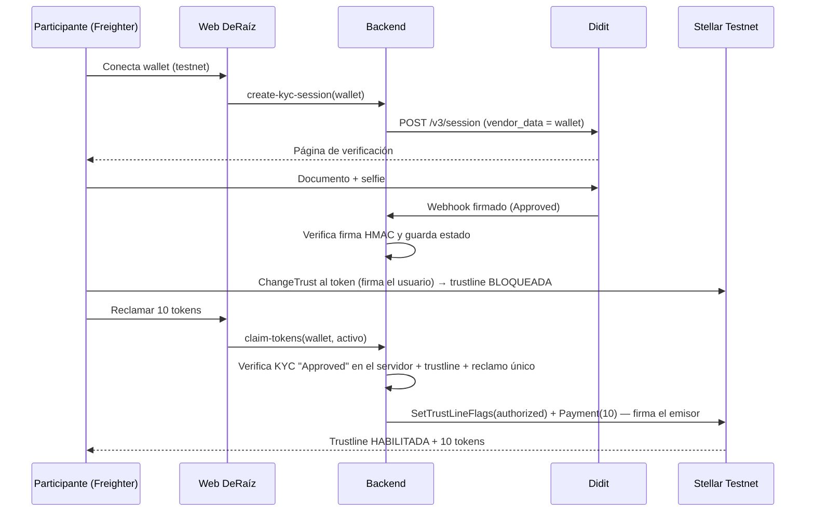

<p align="center">
  
</p>

<h1 align="center">DeRaíz</h1>

<p align="center">
  <b>Trazabilidad de producción agrícola de Latinoamérica con compliance nativo en Stellar</b><br/>
  Stellar Odyssey Perú · Track 3: Real-World Assets &amp; Compliant Rails
</p>

<p align="center">
  <a href="https://deraiz.lovable.app">Demo en vivo</a> ·
  <a href="#evidencia-on-chain-testnet">Evidencia on-chain</a> ·
  <a href="#video-demo">Video demo</a>
</p>

> **Aviso:** DeRaíz es un prototipo educativo construido para una hackathon. Todo funciona en **Stellar Testnet**, sin dinero real. Los proyectos agrícolas son **ficticios** y los tokens son **tokens de trazabilidad de prueba**: no se compran, no tienen valor económico y no otorgan derechos sobre ingresos, activos ni resultados. Nada de este repositorio constituye una oferta de inversión ni de valores.

---

## El problema

La producción agrícola de Latinoamérica (frambuesa en Perú; hongos, pistacho y miel en Argentina) necesita financiamiento y trazabilidad, pero cualquier representación digital de esos activos enfrenta el mismo requisito: **solo personas verificadas pueden tener el token**, y el emisor tiene que poder **corregir** una situación irregular (un KYC fraudulento, una orden judicial).

En la mayoría de las plataformas ese control vive en la web o en una base de datos: si alguien interactúa directamente con la blockchain, el control desaparece.

## La solución

DeRaíz demuestra un **riel de compliance de punta a punta** donde la regla la hace cumplir **la propia red Stellar**, no la página web:

1. El participante conecta su wallet (**Freighter**, no custodial).
2. Verifica su identidad con **Didit** (documento + prueba de vida + coincidencia facial).
3. Didit avisa el resultado por **webhook firmado**; el backend lo valida.
4. El participante abre una **trustline** al token del proyecto: queda **bloqueada**, porque el emisor tiene activado `AUTH_REQUIRED`.
5. Solo si el KYC está aprobado, el **emisor habilita la trustline y envía 10 tokens** en una única transacción.

El emisor conserva dos herramientas de corrección on-chain: **revocar** la habilitación (`AUTH_REVOCABLE`) y **recuperar** tokens (`AUTH_CLAWBACK_ENABLED`).

---

## Qué se construyó durante la ventana del evento

| Componente | Estado |
|---|---|
| Web app (5 páginas, 4 proyectos ficticios, navegación y filtros, diseño responsive) | ✅ |
| Conexión de wallet Freighter en testnet + lectura on-chain de saldos e historial (Horizon) | ✅ |
| KYC real con Didit: creación de sesión, webhook con verificación de firma HMAC, consulta de estado | ✅ |
| KYC reutilizable: una verificación por wallet habilita todos los proyectos | ✅ |
| Cuenta emisora en testnet con `AUTH_REQUIRED`, `AUTH_REVOCABLE` y `AUTH_CLAWBACK_ENABLED` | ✅ |
| Creación de trustline firmada por el usuario (queda bloqueada hasta la habilitación) | ✅ |
| Reclamo: el backend verifica el KYC en el servidor, habilita la trustline y envía 10 tokens en una sola transacción firmada por el emisor | ✅ |
| Seguridad de base de datos: solo el backend escribe estados KYC y reclamos | ✅ |

**Punto de partida (commit base):** el repositorio parte de la plantilla oficial de Lovable `tanstack_start_ts` (commit `07342b2`, 22/09/2026). Todo lo demás se construyó entre el 23 y el 25 de septiembre de 2026, dentro de la ventana de desarrollo.

**Herramientas de desarrollo:** la interfaz y el backend se generaron con **Lovable** (desarrollo asistido por IA), bajo el diseño, las especificaciones y la revisión del equipo. Por eso parte del historial de commits figura a nombre del bot de Lovable. La cuenta emisora y sus flags se configuraron manualmente con **Stellar Laboratory**.

---

## Arquitectura



| Capa | Tecnología | Rol |
|---|---|---|
| Frontend | React, TypeScript, TanStack Start, Tailwind, Lovable | Interfaz, conexión de wallet, lectura on-chain |
| Wallet | Freighter (`@stellar/freighter-api`) | El usuario firma su trustline; DeRaíz nunca tiene sus claves |
| Stellar | `@stellar/stellar-sdk` + Horizon testnet | Construcción, firma y envío de transacciones |
| Backend | Supabase (Postgres) + funciones de servidor | KYC, webhook, reclamos; guarda las claves secretas |
| KYC | Didit | Verificación de identidad alojada + webhook |

### Flujo de compliance



---

## Integración con Stellar

**Activos:** cuatro activos clásicos de Stellar emitidos por una única cuenta emisora. 1 token = 1 kg de producción de un lote ficticio.

| Proyecto (ficticio) | País | Activo |
|---|---|---|
| Frambuesa Valle Rojo | Perú | `FRAMB` |
| Hongos Micelio Sur | Argentina | `HONGO` |
| Pistacho Oasis Cuyano | Argentina | `PISTA` |
| Miel Monte Dorado | Argentina | `MIEL` |

**Cuenta emisora:** [`GAWC4ZMA4MGJF3TM5LW5BWPPQWL4JTFNXLPUGPLSWIV6UE3L4X7HSR6X`](https://stellar.expert/explorer/testnet/account/GAWC4ZMA4MGJF3TM5LW5BWPPQWL4JTFNXLPUGPLSWIV6UE3L4X7HSR6X)

| Flag del emisor | Valor | Efecto |
|---|---|---|
| `AUTH_REQUIRED` | 1 | Nadie puede tener el token sin habilitación del emisor |
| `AUTH_REVOCABLE` | 2 | El emisor puede quitar la habilitación |
| `AUTH_CLAWBACK_ENABLED` | 8 | El emisor puede recuperar tokens |
| **Total configurado** | **11** | `AUTH_IMMUTABLE` no se activó, para poder ajustar la configuración |

**Por qué activos clásicos con flags y no un contrato propio:** en Stellar, el control de tenencia es una propiedad **nativa del activo**. La red rechaza cualquier pago a una trustline no habilitada, sin importar desde dónde se envíe, así que el compliance no depende de que el usuario pase por nuestra web.

**Costos:** la habilitación + envío de tokens costó **0,00002 XLM** (dos operaciones en una transacción).

---

## Evidencia on-chain (testnet)

| # | Qué demuestra | Transacción |
|---|---|---|
| 1 | Activación de los flags de compliance en el emisor (`set_flags: 11`) | [`86f0f580380b126b610085a1f3f7fd9064522d94829813d8f577726069173803`](https://stellar.expert/explorer/testnet/tx/86f0f580380b126b610085a1f3f7fd9064522d94829813d8f577726069173803) |
| 2 | El participante crea su trustline a `FRAMB` (queda bloqueada) | [`ca1bb44bd7891066b48dbd16fda199c7c628afb786d2f184ef303bc8dd7df353`](https://stellar.expert/explorer/testnet/tx/ca1bb44bd7891066b48dbd16fda199c7c628afb786d2f184ef303bc8dd7df353) |
| 3 | **Tras el KYC aprobado, el emisor habilita la trustline y envía 10 `FRAMB`** (2 operaciones, 1 transacción) | [`5d4df96f30ca828a0caf3d0014a92fa98a57c264e158c7e59e3073c7a72e1d01`](https://stellar.expert/explorer/testnet/tx/5d4df96f30ca828a0caf3d0014a92fa98a57c264e158c7e59e3073c7a72e1d01) |
| 4 | El mismo flujo con `HONGO` (el que muestra el video demo): habilitación + envío de 10 tokens en una transacción | [`a8d76860ff91c2636e8d329bc761099201661e8418760fc3806da91ddbe7ddcc`](https://stellar.expert/explorer/testnet/tx/a8d76860ff91c2636e8d329bc761099201661e8418760fc3806da91ddbe7ddcc) |

Estado resultante de la trustline del participante, según Horizon:

```json
{
  "balance": "10.0000000",
  "is_authorized": true,
  "is_clawback_enabled": true,
  "asset_code": "FRAMB",
  "asset_issuer": "GAWC4ZMA4MGJF3TM5LW5BWPPQWL4JTFNXLPUGPLSWIV6UE3L4X7HSR6X"
}
```

`is_clawback_enabled: true` confirma que el emisor conserva la capacidad de recuperar los tokens de esa wallet.

---

## Seguridad

- **Claves solo en el servidor:** la API key de Didit, el secreto del webhook y la clave del emisor viven como secretos del backend. Nunca llegan al navegador ni al repositorio.
- **Webhook autenticado:** cada aviso de Didit se valida con HMAC-SHA256 y control de antigüedad (5 minutos). Si la firma no coincide, se rechaza.
- **El KYC se verifica en el servidor:** el reclamo consulta el estado en la base de datos; nunca confía en lo que envía el navegador.
- **Nadie puede "aprobarse solo":** las políticas de la base de datos solo permiten escribir estados y reclamos al backend.
- **Un reclamo por wallet y activo:** restricción única en la base de datos, que también evita reclamos dobles simultáneos.
- **No custodial:** DeRaíz nunca tiene las claves del participante.

---

## Cómo probar la demo

Requisitos: navegador con la extensión [Freighter](https://www.freighter.app), configurada en **Testnet** y con XLM de prueba (Friendbot).

1. Entrar a **https://deraiz.lovable.app** y tocar **Conectar wallet**.
2. Elegir un proyecto y tocar **Verificar identidad** (Didit).
3. Volver a **Mi cuenta** y esperar el estado **Aprobado**.
4. En el proyecto, **Crear trustline** y firmar en Freighter. En *Mi cuenta* aparece como *Bloqueada*.
5. **Reclamar 10 tokens de prueba**. La trustline pasa a *Habilitada* y el saldo a 10, con el hash de la transacción.

## Cómo ejecutarlo localmente

```bash
git clone https://github.com/diegoortizcpn-svg/deraiz.git
cd deraiz
npm install
npm run dev
```

El archivo `.env` incluido contiene solo datos públicos de Supabase (URL y clave publicable). Para que funcionen el KYC y el reclamo, el backend necesita estas variables:

| Variable | Qué es |
|---|---|
| `DIDIT_API_KEY` | API key de Didit |
| `DIDIT_WORKFLOW_ID` | ID del workflow de verificación en Didit |
| `DIDIT_WEBHOOK_SECRET` | Secreto de firma del webhook de Didit |
| `STELLAR_ISSUER_SECRET` | Clave secreta de la cuenta emisora de testnet |
| `SUPABASE_URL`, `SUPABASE_SERVICE_ROLE_KEY` | Acceso del backend a la base de datos |

**Para usar un emisor propio:** en [Stellar Laboratory](https://lab.stellar.org) (Testnet), generar un par de claves, fondearlo con Friendbot, ejecutar una operación *Set Options* con los flags 1 + 2 + 8 = 11 y reemplazar la dirección en `src/config/assets.ts`.

### Archivos principales

| Archivo | Función |
|---|---|
| `src/config/assets.ts` | Red, emisor y códigos de los activos |
| `src/lib/wallet.tsx` · `src/lib/stellar.ts` | Conexión con Freighter y lectura de Horizon |
| `src/lib/kyc.*.ts` | Sesión Didit y consulta de estado |
| `src/routes/api/public/didit-webhook.ts` | Webhook de Didit con verificación de firma |
| `src/lib/claim.*.ts` | Reclamo: validaciones + habilitación + envío firmado por el emisor |
| `supabase/migrations/` | Tablas y políticas de seguridad |

---

## Hoja de ruta

Lo siguiente **no forma parte de lo construido**; es la evolución prevista:

1. **Emisor con multisig:** eliminar el riesgo de una clave única del emisor.
2. **Hitos on-chain con Soroban:** un contrato que registre hitos productivos certificados por un validador independiente (plantación, cosecha). La versión actual usa activos clásicos con flags de autorización.
3. **Prueba de propiedad de la wallet:** que el participante firme un mensaje con Freighter antes del KYC, para asegurar que la wallet verificada es suya.
4. **Pilotos con productores reales** en Perú y Argentina, con validación de hitos en campo.
5. **Marco regulatorio:** operación bajo la normativa de cada país antes de cualquier uso productivo.

---

## Video demo

🎥 *[Link al video demo]* — pendiente de carga.

## Equipo

| Integrante | Rol | GitHub |
|---|---|---|
| Diego J. Ortiz | Estructuración, desarrollo e integración | [@diegoortizcpn-svg](https://github.com/diegoortizcpn-svg) |
| Jean Nuñez | Estructuración y pitch | *[@JCNP-Dev](https://github.com/JCNP-Dev)* |

## Librerías de terceros

| Librería | Licencia |
|---|---|
| `@stellar/stellar-sdk`, `@stellar/freighter-api` | Apache-2.0 |
| React, TanStack (Start, Router, Query), Tailwind CSS, Radix UI, shadcn/ui, framer-motion, Zod, Sonner, `@supabase/supabase-js` | MIT |
| lucide-react | ISC |
| Plantilla base: Lovable `tanstack_start_ts` | — |

Servicios externos: Didit (KYC), Supabase (base de datos y backend), Stellar Testnet (Horizon), Lovable (hosting y desarrollo).

## Licencia

[MIT](LICENSE) © 2026 Diego Ortiz y Jean Nuñez
